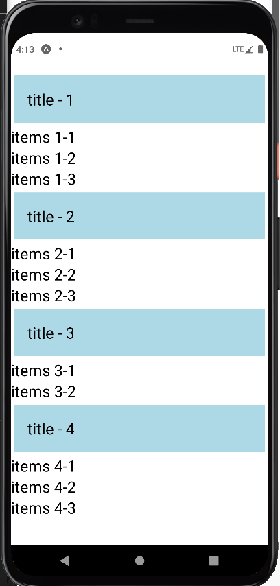
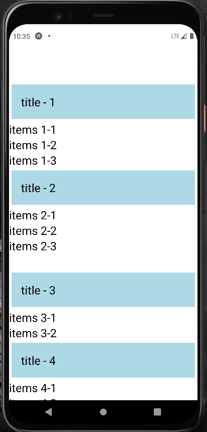

# About the Tutorial
To master the basics of React Native for iOS and Android Mobile App Development

### Basic Components:
1.
2.
3.
4. [SectionList](README.md#sectionlist-component)
5. [Custom Component for SectionList](README.md#custom-component-for-sectionlist)
6. [Pressable](README.md#pressable)
7. 

### SectionList Component:

The React Native SectionList component is a list view component which sets the list of data into sections. The data can be implemented using its section header prop renderSectionHeader.

Refer: [SectionList.js](SectionList.js)

Basic props:
> KeyExtractor - If the key is not available for the items in the list, then this prop is used to assign unique key for all the items in the List with there index values.

> sections - Which get the while list or data as a input.

> renderItems - To render through all the leaf items in the list or data.

> renderSectionHeader - To render at top of the each section (like title for each section)

### Custom Component for SectionList:

Create separate js file for SectionList component and import in main App.js file for more reuseability.

Refer: [CustomSectionListApp.js](CustomSectionListApp.js), [CustomSectionList.js](CustomSectionList.js)

### Pressable:

New React Native Component, it is basically a wrapper and for provide pressable interaction among the trial components. It is for only iso App, Not support by Android Apps.

Sorry Guys, As I am using Android stimulator I can't able to provide a output for you. If you have a iso stimulator copy my code try it on your system.

Refer: [Pressable.js](Pressable.js)

###
