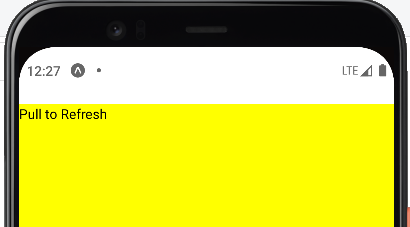
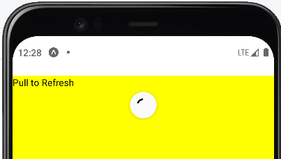

# About the Tutorial
To master the basics of React Native for iOS and Android Mobile App Development

### Basic Components:
1. [Text Props](README.md#text-props)
2. [View Props](README.md#view-props)
3. [Image Props](README.md#image-props)
14. [SectionList](README.md#sectionlist-component)
15. [Custom Component for SectionList](README.md#custom-component-for-sectionlist)
16. [Pressable](README.md#pressable)
17. [RefreshControl](README.md#refreshcontrol)
18. [InputAccessoryView.js](README.md#InputAccessoryView.js)
19. 
20. 
21. 
22. 

### Text props

Following are the main props available on ReactNative to edit the text.

> color - Used to change the color of the text.

> fontSize - To adjust the size of the font.

> fontFamily - used to change the font family of the text.

> fontStyle - Used to change the font style as bold, italic or underline etc.

> fontWeight - Used to change the thickness of the text.

> letterSpacing - To assign the space between the letter.

> textAlign - It provide the auto, center, left, Right and justify option to align the text.

> textDecorationLine - With available option like underline, line-through, none, underline-line-through etc we can modify the text.

> textDecorationColor - Used to change the color of the line.

> textDecorationStyle - Only used in iOS devices, to change the style of the underline by dashed, dotted, double etc.

> textTransform - It provide capitalize, lowercase and uppercase option to modify the text.

### View Props

Following are the main props available on ReactNative for the View Components.

> backgroundColor - To change the background color of the components.

> flex - Responsive separation or selection of the screen equally.

> padding - To provide the interior space for the View Component. (You can also provide padding for individual sides, like left, right, top, and bottom as right-padding)

> margin - To provide the outer space of the View Component. (You can also provide margin for individual sides, like left, right, top, and bottom as left-margin)

> borderWidth - To provide width of the border of the Component. (You can also provide border width for individual sides, like left, right, top, and bottom as borderBottomWidth)

> borderColor - To provide different color for the border. (You can also provide border color for individual sides, like left, right, top, and bottom as borderLeftColor)

> borderRadius - To make a curve in the corner of the view component or the border. (You can also provide border radius for individual sides, like BottomLeft, BottomRight, TopRight, and TopLeft as borderBottomLeftRadius)

> opacity - To provide the transparency for the component.

###

### SectionList Component:

The React Native SectionList component is a list view component which sets the list of data into sections. The data can be implemented using its section header prop renderSectionHeader.

Refer: [SectionList.js](SectionList.js)

Basic props:
> KeyExtractor - If the key is not available for the items in the list, then this prop is used to assign unique key for all the items in the List with there index values.

> sections - Which get the while list or data as a input.

> renderItems - To render through all the leaf items in the list or data.

> renderSectionHeader - To render at top of the each section (like title for each section)

### Custom Component for SectionList:

Create separate js file for SectionList component and import in main App.js file for more reuseability.

Refer: [CustomSectionListApp.js](CustomSectionListApp.js), [CustomSectionList.js](CustomSectionList.js)

### Pressable:

New React Native Component, it is basically a wrapper and for provide pressable interaction among the trial components. It is for only iOS App, Not support by Android Apps.

Since I am using Android stimulator, I cannot provide an output for you. Try my code on your system if you have an ISO stimulator.

Refer: [Pressable.js](Pressable.js)

### RefreshControl:

It is React native component basically used inside a List Components as prop to refresh the page or components.

Basic props: 

> refreshing - To set the refresh is true or false

> onRefresh - What are changes had to happend after or during refresh. 

Refer: [RefreshControl.js](RefreshControl.js)

 &#160; 

### InputAccessoryView:

It only works with the iOS devices. A component which enables customization of the keyboard input accessory view on iOS. The input accessory view is displayed above the keyboard whenever a TextInput has focus. This component can be used to create custom toolbars.

> nativeID - An ID which is used to associate this InputAccessoryView to specified TextInput.

Since I am using Android stimulator, I cannot provide an output for you. Try my code on your system if you have an ISO stimulator.

Refer: [InputAccessoryView.js](InputAccessoryView.js)

###

###

###
